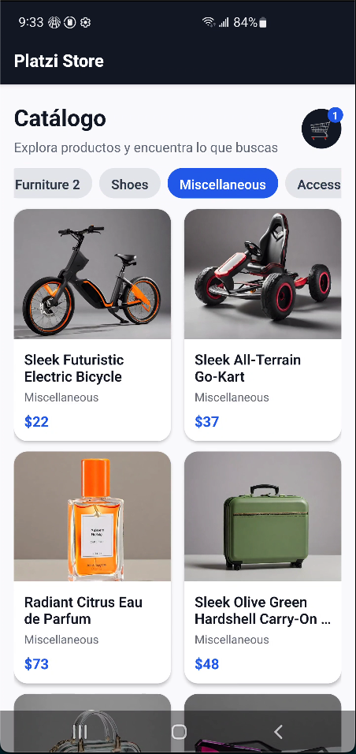
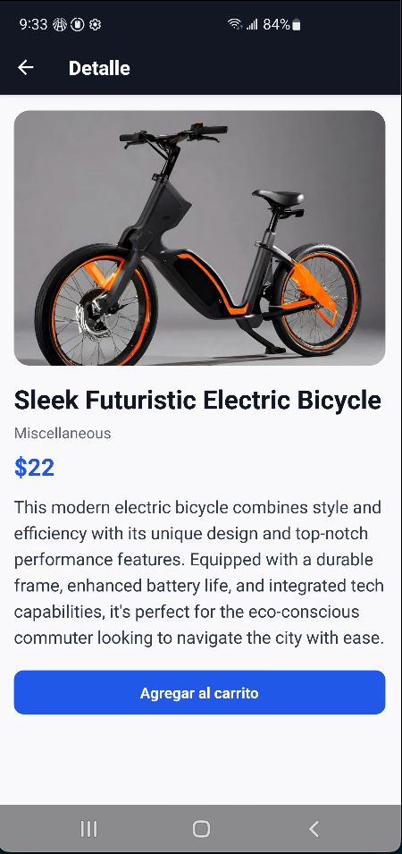
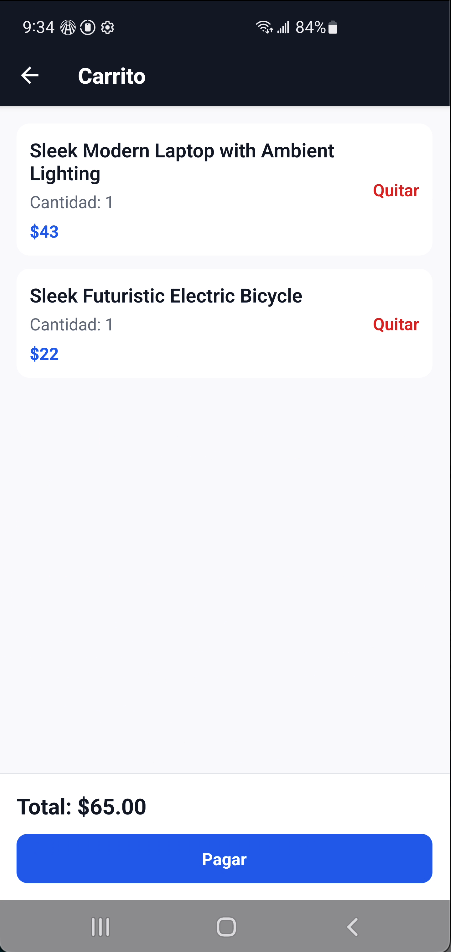

# 🛍️ Platzi Store

Aplicación móvil desarrollada con **React Native**, **Expo** y **TypeScript** como proyecto final del curso de React Native. La aplicación consume la **Platzi Fake Store API** para mostrar un catálogo de productos, permitiendo navegar por categorías, consultar el detalle de cada producto y administrar un carrito de compras.

---

## 📱 Características

- 📦 Catálogo de productos obtenido desde una API REST.
- 🏷️ Filtrado dinámico por categorías.
- 🔍 Pantalla de detalle del producto.
- 🛒 Carrito de compras mediante React Context.
- 🔢 Contador de productos en el carrito.
- 📄 Paginación (Infinite Scroll).
- 🔄 Pull to Refresh.
- ⚠️ Manejo de estados de carga y errores.
- 💳 Simulación del proceso de pago.

---

# 📸 Capturas de pantalla

> Reemplaza estas imágenes por las capturas de tu aplicación.

| Home | Detalle | Carrito |
|------|----------|----------|
|  |  |  |

---

# 🏗️ Arquitectura

El proyecto está organizado siguiendo una estructura modular, separando la lógica de negocio, la navegación y los componentes reutilizables.

```text
src
├── api
│   └── api.ts
├── components
│   └── ProductCard.tsx
├── context
│   └── CartContext.tsx
├── hooks
│   └── useProducts.tsx
├── navigation
│   └── AppNavigator.tsx
└── screens
    ├── HomeScreen.tsx
    ├── DetailScreen.tsx
    └── CartScreen.tsx
```

## Estructura del proyecto

| Carpeta | Responsabilidad |
|----------|-----------------|
| **api** | Centraliza todas las llamadas HTTP a la API. |
| **components** | Componentes reutilizables de la interfaz. |
| **context** | Estado global del carrito mediante React Context. |
| **hooks** | Custom Hooks con la lógica de negocio. |
| **navigation** | Configuración de React Navigation. |
| **screens** | Pantallas principales de la aplicación. |

---

# 🧰 Tecnologías utilizadas

- React Native
- Expo
- TypeScript
- React Navigation
- React Context API
- Platzi Fake Store API

---

# 🌐 API utilizada

La aplicación consume la API pública de Platzi:

```text
https://api.escuelajs.co/api/v1
```

### Endpoints utilizados

- `/products`
- `/categories`
- `/categories/{id}/products`

---

# 🚀 Instalación

## 1. Clonar el repositorio

```bash
git clone https://github.com/victoralejandrobriones/platzi-store.git
```

## 2. Entrar al proyecto

```bash
cd platzi-store
```

## 3. Instalar dependencias

```bash
npm install
```

---

# ▶️ Ejecutar la aplicación

## Opción 1: Expo Go

Si únicamente deseas iniciar el servidor de desarrollo:

```bash
npx expo start
```

---

## Opción 2: Ejecutar en un dispositivo físico (Recomendado)

> **Este proyecto fue desarrollado y probado utilizando Expo Prebuild.**
>
> Para obtener el mismo comportamiento que durante el desarrollo, se recomienda ejecutar la aplicación directamente sobre un dispositivo físico utilizando los siguientes comandos.

### Android

#### 1. Generar el proyecto nativo

```bash
npx expo prebuild --platform android --clean
```

#### 2. Ejecutar la aplicación en un dispositivo conectado

```bash
npx expo run:android --device
```

---

### iOS (macOS)

#### 1. Generar el proyecto nativo

```bash
npx expo prebuild --platform ios --clean
```

#### 2. Ejecutar la aplicación en un iPhone conectado

```bash
npx expo run:ios --device
```

> **¿Por qué utilizar `prebuild --clean`?**
>
> Este comando regenera completamente los proyectos nativos de Android o iOS a partir de la configuración de Expo. Es especialmente útil cuando se agregan nuevas dependencias nativas o se modifican configuraciones del proyecto, asegurando que los cambios se reflejen correctamente antes de compilar.

---

# 📖 Funcionalidades implementadas

## Catálogo

- Obtención de productos desde la API.
- Paginación utilizando `offset` y `limit`.
- Actualización mediante Pull to Refresh.

## Categorías

- Obtención dinámica desde la API.
- Filtrado de productos por categoría.
- Categoría adicional **All** para visualizar todos los productos.

## Carrito

- Agregar productos.
- Incrementar automáticamente la cantidad de un producto existente.
- Eliminar productos del carrito.
- Vaciar completamente el carrito.
- Cálculo automático del total de la compra.

## Navegación

- Home → Detail
- Detail → Cart
- Home → Cart

---

# 📚 Conceptos de React utilizados

- Functional Components
- TypeScript
- Custom Hooks
- React Context
- useState
- useEffect
- useCallback
- useMemo
- useRef
- FlatList
- RefreshControl
- React Navigation

---

# 📌 Posibles mejoras

- Persistencia del carrito utilizando AsyncStorage.
- Búsqueda de productos.
- Lista de favoritos.
- Autenticación de usuarios.
- Integración con una pasarela de pagos.
- Animaciones.
- Pruebas unitarias y de integración.

---

# 👨‍💻 Autor

Desarrollado como proyecto final del curso de **React Native**, utilizando **Expo**, **TypeScript** y la **Platzi Fake Store API** para demostrar conceptos fundamentales de:

- Desarrollo móvil multiplataforma.
- Consumo de APIs REST.
- Arquitectura basada en componentes.
- Navegación entre pantallas.
- Manejo de estado global mediante React Context.
- Desarrollo con Custom Hooks.